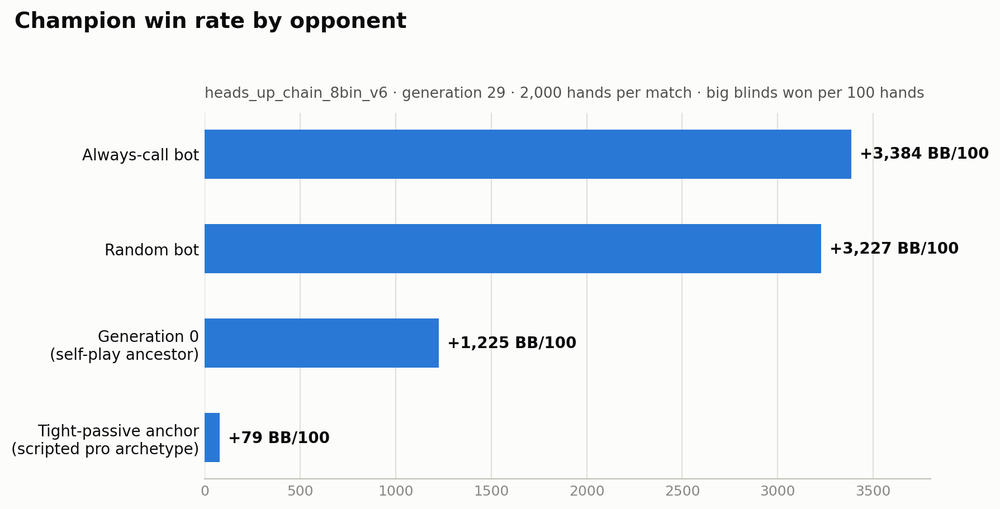
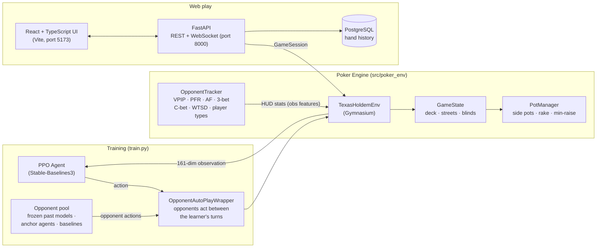
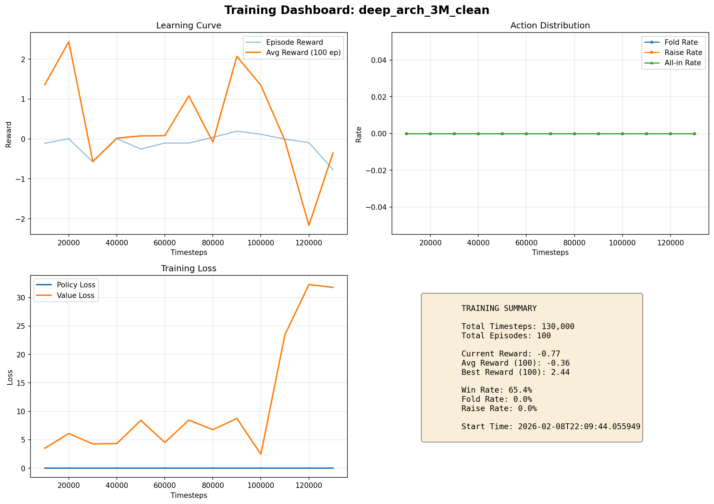

# 🃏 LagBot

**A Texas Hold'em poker bot that learns to play through deep reinforcement learning — and learns to exploit *you* through opponent modeling.**

LagBot (named for the *Loose-AGgressive* poker style) trains a PPO agent inside a from-scratch, Gymnasium-compatible No-Limit Hold'em environment, then lets you sit down against it in a React web client or straight from the terminal. What sets it apart from a vanilla poker RL setup is the built-in **opponent tracker**: a real-time HUD engine that computes the same stats a professional online player would use — VPIP, PFR, aggression factor, 3-bet %, C-bet %, WTSD, and more — and feeds them directly into the agent's observation vector. The bot doesn't just learn *poker*; it learns to adapt to the specific players at the table.

```text
============================================================
Hand #2 - FLOP
============================================================
Community: 9c 4s 7h
Pot: $30
Bet: $0, Min Raise: $10

→ Player_0: $1590 (Bet: $0) [Jd 2d]
  Player_1: $690  (Bet: $0) [## ##]
  (BTN) Player_2: $690 (Bet: $0) [## ##]

📊 Opponent Stats:
  P0: VPIP=0.0%   PFR=0.0% AF=0.50
  P1: VPIP=100.0% PFR=0.0% AF=0.33
  P2: VPIP=100.0% PFR=0.0% AF=0.33
============================================================
```

---

## Results

The current champion — **generation 29 of the v6 self-play chain** — was benchmarked head-to-head with [`scripts/duel.py`](scripts/duel.py), 2,000 hands per match (heads-up, 5/10 blinds, 1,000-chip stacks, fixed seed):



| Opponent | Result (BB/100) | Verdict |
|----------|----------------:|---------|
| Always-call bot | **+3,384** | crushes it |
| Random bot | **+3,227** | crushes it |
| Generation 0 (its own self-play ancestor) | **+1,225** | clear improvement across the chain |
| Tight-passive anchor (scripted pro archetype) | **+79** | solid edge vs a competent strategy |

The pattern is what you want from a learned policy: enormous edges against exploitable opponents, and a smaller but consistent edge against the hardest scripted archetype. Every number is reproducible:

```bash
python scripts/duel.py models/heads_up_chain_8bin_v6_gen29 call --num-hands 2000 --seed 1
```

### By the numbers

| Metric | Value |
|--------|------:|
| PPO generations trained across all lineages | **149** |
| Training timesteps per generation | 2,000,000 |
| Cumulative training timesteps | **~300M** |
| Scripted anchor archetypes in the opponent pool | 10 |
| Observation dimensions (incl. live opponent HUD stats) | 161 |
| Automated tests | **503** |

---

## Quick Start

### Environment setup

Dependencies are managed with [uv](https://docs.astral.sh/uv/). Install it once (`curl -LsSf https://astral.sh/uv/install.sh | sh`), then:

```bash
# Install everything (core + backend + dev tools). uv auto-installs Python 3.11 if missing.
uv sync --all-groups

# Or install only what you need:
uv sync                  # core + dev (training, tests)
uv sync --group backend  # core + dev + backend server
```

This creates `.venv/` and is fully reproducible from `uv.lock`. `uv run <cmd>` runs commands inside it without needing to manually activate.

### Play via Web

```bash
# Option 1: Docker Compose (recommended)
docker compose up
# Open http://localhost:5173

# Option 2: Manual
PYTHONPATH=. uv run uvicorn backend.main:app --host 0.0.0.0 --port 8000

# In a second terminal:
cd frontend && npm run dev
# Open http://localhost:5173
```

### Train a Model

```bash
uv run python train.py --config configs/default_config.yaml --name my_run
```

### Play from CLI

```bash
PYTHONPATH=. uv run python play.py
```

### Run tests

```bash
uv run pytest
```

---

## How it works



Each training run saves its checkpoint into an agent registry; later runs sample opponents from that pool — frozen past generations, scripted **anchor agents**, and simple baselines — so the bot keeps facing a curriculum of stronger and more varied opposition. An **eval gate** makes each generation beat its parent head-to-head before it graduates into the pool, which is why the chain improves monotonically enough that generation 29 beats generation 0 by **+1,225 BB/100**.

---

## Features

### 🎰 Full No-Limit Hold'em engine
- 2–10 players, configurable stacks, blinds, and rake
- Correct betting rounds, min-raise enforcement, and button/blind rotation
- **All-in and side pots done right**: layered pot construction with per-pot eligibility, tied-hand splits, deterministic odd-chip distribution, and rake applied only to contested pots
- Hand histories that can replay a full hand street by street

### 🎯 Action space (`Discrete(6)` by default)

| Action | Meaning |
|--------|---------|
| 0 | Fold |
| 1 | Check / Call |
| 2 | Raise 50% of pot |
| 3 | Raise 100% of pot |
| 4 | Raise 200% of pot |
| 5 | All-in |

Raise sizes are computed from the live pot, rounded to the big blind, floored at the min-raise, and clamped to the stack. The bins are configurable via `raise_bins` / `set_raise_bins()` — the latest self-play chains train with **8 bins** (25%–500% of pot) for finer bet sizing, and `duel.py` bridges models trained on different bin sets so any two generations can play each other.

### 👁️ Observation space (`Box(161,)`)
- **53 base dims** — 7 cards × 6 dims (rank + suit one-hot + presence), Monte-Carlo **hand strength**, **pot odds**, **stack-to-pot ratio**, plus normalized stack / pot / bet / to-call, position, street, and button
- **108 opponent dims** — 9 seats × 12 HUD features: VPIP, PFR, AF, 3-bet %, C-bet %, fold-to-C-bet, WTSD, W$SD, WWSF, fold-to-3-bet, squeeze %, and a confidence score that ramps up with sample size

### 📊 Opponent modeling
The `OpponentTracker` maintains a full HUD profile per player, classifies opponents into player types (TAG, LAG, nit, calling station), and can surface exploitation suggestions. Its stats stream into both the agent's observations and the terminal/web display.

### 🧪 Training machinery
- **Generational self-play**: 149 PPO generations trained so far. Ten scripted anchor archetypes (tight-passive, loose-aggressive, calling station, shover, …) define style buckets and seed the early curriculum; once a bucket has a learned occupant, the anchor retires and the bot trains against past versions of itself — true self-play with style diversity guaranteed
- **Stratified opponent sampling** from a persistent JSON agent registry that records every checkpoint's lineage, training steps, and observed stats
- **Regret-shaped rewards** (`regret_blend` mode) layered on the base big-blinds-won-per-hand signal
- **Eval gate**: a new checkpoint must beat its parent head-to-head (same code path as `duel.py`) before it graduates into the opponent pool
- TensorBoard logging plus JSON metrics and dashboard generation (`scripts/dashboard_gen.py`)



---

## Project Structure

```text
LagBot/
├── train.py                  # Training entry point (PPO + opponent curriculum)
├── play.py                   # Interactive CLI game
│
├── src/
│   ├── poker_env/            # Engine: env, game state, pots, hand eval, opponent tracker
│   ├── agents/               # PPO wrapper, frozen-model opponents, anchors, baselines
│   └── training/             # Wrapper, opponent sampler, eval gate, callbacks, metrics
│
├── backend/                  # FastAPI REST + WebSocket server
│   ├── api/                  # Routes + WebSocket handler
│   ├── services/             # GameSession + GameManager
│   ├── db/                   # PostgreSQL hand history
│   └── utils/                # State serializer, card converter
│
├── frontend/                 # React 18 + TypeScript UI
│   └── src/
│       ├── components/       # PokerTable, Controls, Modals, Sidebar
│       ├── stores/           # Zustand game state store
│       └── hooks/            # useWebSocket
│
├── configs/                  # Training config YAML files
├── scripts/                  # Dashboards, diagnostics, checkpoint sweeps, utilities
├── tests/                    # Test suite (engine, agents, training)
├── docs/                     # Documentation + training charts
└── metrics/                  # Training metrics JSON
```

---

## Docs

- [`docs/ARCHITECTURE.md`](docs/ARCHITECTURE.md) — System design and data flow
- [`docs/TRAINING_GUIDE.md`](docs/TRAINING_GUIDE.md) — How to train models
- [`docs/GPU_TRAINING_GUIDE.md`](docs/GPU_TRAINING_GUIDE.md) — Apple Silicon / CUDA setup
- [`docs/QUICK_START.md`](docs/QUICK_START.md) — Quick reference
- [`docs/TESTING.md`](docs/TESTING.md) — Testing procedures
- [`docs/CHANGELOG.md`](docs/CHANGELOG.md) — History of major changes

---

## Tech Stack

| Layer | Tech |
|-------|------|
| Game Engine | Python, Gymnasium, Stable-Baselines3 PPO, Treys |
| Backend | FastAPI, Uvicorn, asyncpg, PostgreSQL |
| Frontend | React 18, TypeScript, Vite, Zustand, Tailwind CSS |
| Deployment | Docker Compose |
